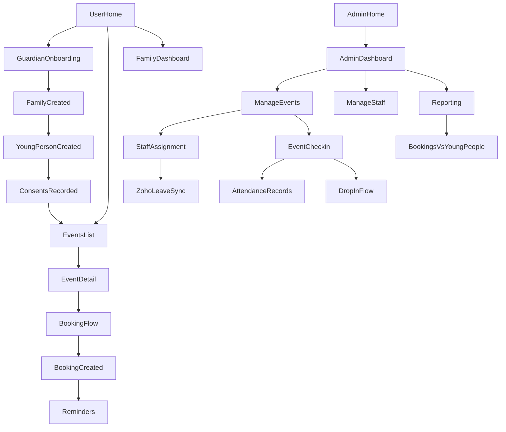

## OYCI booking & participation system – detailed spec

### 1. Problem summary

- **Inclusive access**: Implement a simple, user-friendly system for bookings and data management that does not exclude digitally disadvantaged families.
- **Better measurement**: Distinguish clearly between:
  - **Bookings** (reservations),
  - **Unique young people** engaging,
  - **How often** each young person attends.
- **Insightful bookings**: Use the booking process as a tool to help OYCI understand and respond to community needs (not as a barrier).
- **Operational efficiency**: Integrate staff scheduling, leave management, and payroll to save time and reduce errors.
- **Spontaneous participation**: Support drop-ins and spontaneous attendance alongside pre-booked sessions.
- **Confidentiality & consent**: Handle annual confidentiality renewals and other consents in a user-friendly way.
- **Scalability**: Replace fragmented tools (Bookeo, Zoho People, Xero, MS365 spreadsheets) with a coherent flow so OYCI can scale impact.

---

### 2. Domain model

#### 2.1 Core entities

- **Family**
  - `id`
  - `primary_guardian_id` (FK → Guardian, optional)
  - `name` (e.g. “Smith family”)
  - `address_line_1`, `address_line_2`, `town`, `postcode`
  - `phone_primary`, `phone_secondary`
  - `preferred_contact_method` (SMS, call, email, letter)
  - `notes` (sensitive; permissioned)
  - `created_by_staff_id` (FK → StaffMember, nullable)
  - `created_at`, `updated_at`
  - **Rules**:
    - A family can exist without a guardian login (staff-created).
    - Duplicate-prevention via “possible duplicate” flag (postcode + similar names/phone).

- **Guardian (User)**
  - `id`
  - `family_id` (FK → Family)
  - `first_name`, `last_name`
  - `email` (nullable if SMS-only)
  - `phone`
  - `password_hash` / `auth_provider`
  - `is_primary`
  - `language_preference`
  - `communication_opt_in`
  - `created_at`, `updated_at`, `last_login_at`
  - **Rules**:
    - A family can have multiple guardians.
    - Any guardian for a family can book for any young person in that family.

- **YoungPerson**
  - `id`
  - `family_id` (FK → Family)
  - `first_name`, `last_name`, `preferred_name`
  - `date_of_birth`
  - `gender` (optional)
  - `school_name`, `school_year`
  - `additional_support_needs`
  - `medical_info`
  - `dietary_requirements`
  - `emergency_contact_name`, `emergency_contact_phone`
  - `is_active`
  - `created_at`, `updated_at`
  - **Rules**:
    - Age is derived from DOB and used for event eligibility.
    - Can be created with minimal info for drop-ins; flagged as `profile_incomplete`.

- **ConsentRecord**
  - `id`
  - `young_person_id` (FK → YoungPerson)
  - `version`
  - `type` (confidentiality, photos, emergency_treatment, transport, etc.)
  - `given_by_guardian_id` (FK → Guardian, nullable)
  - `given_by_name` (for in-person/paper)
  - `method` (online_guardian_portal, in_person, phone, paper_form)
  - `text_snapshot` or reference to master policy
  - `valid_from`, `valid_until`
  - `created_by_staff_id`, `created_at`
  - **Rules**:
    - At least one valid confidentiality consent required for new bookings (soft-block if missing).
    - Reporting uses validity dates, not just latest record.

- **Event**
  - `id`
  - `programme_id` (optional grouping)
  - `name`, `description`
  - `location_name`, `location_address`, `postcode`
  - `age_min`, `age_max`
  - `capacity`
  - `booking_required` (bool)
  - `drop_in_allowed` (bool)
  - `booking_open_at`, `booking_close_at`
  - `max_bookings_per_young_person`
  - `tags` (holiday, after_school, etc.)
  - `is_recurring`, `recurrence_pattern` (if used)
  - `created_by_staff_id`, `created_at`, `updated_at`
  - **Rules**:
    - If `booking_required = false` and `drop_in_allowed = true`, staff can record attendance without bookings.

- **EventInstance**
  - `id`
  - `event_id` (FK → Event)
  - `start_at`, `end_at`
  - `instance_capacity`
  - `status` (scheduled, cancelled, completed)
  - `notes_for_staff`
  - **Rules**:
    - Bookings and attendance link to `EventInstance`.
    - Allows cancelling one date without cancelling the whole series.

- **Booking**
  - `id`
  - `family_id` (FK → Family)
  - `guardian_id` (FK → Guardian, nullable if staff-created)
  - `event_instance_id` (FK → EventInstance)
  - `created_by_staff_id` (nullable)
  - `source` (guardian_portal, staff_portal, phone, paper)
  - `status` (active, cancelled_by_guardian, cancelled_by_staff, waitlisted)
  - `created_at`, `updated_at`, `cancelled_at`
  - **Rules**:
    - A single booking can cover multiple children via `BookingParticipant`.

- **BookingParticipant**
  - `booking_id` (FK → Booking)
  - `young_person_id` (FK → YoungPerson)
  - `attendance_type` (single_session, full_block)
  - `notes_for_staff`
  - **Rules**:
    - Unique per `(booking_id, young_person_id)`.

- **AttendanceRecord**
  - `id`
  - `event_instance_id` (FK → EventInstance)
  - `young_person_id` (FK → YoungPerson)
  - `booking_id` (FK → Booking, nullable for pure drop-in)
  - `status` (booked, arrived, left_early, no_show, cancelled)
  - `source` (pre_generated_from_booking, staff_checkin, bulk_import)
  - `checked_in_at`, `checked_out_at`
  - `recorded_by_staff_id`
  - `notes`
  - **Rules**:
    - Pre-generated as `booked` when a guardian books.
    - Drop-ins create records with `booking_id = null`, `status = arrived`.
    - Attendance metrics count `status` ∈ {arrived, left_early}.

- **StaffMember**
  - `id`
  - `zoho_people_id`
  - `first_name`, `last_name`
  - `email`, `phone`
  - `role` (superadmin, coordinator, staff, volunteer, finance, reporting_only)
  - `skills`
  - `is_active`
  - `created_at`, `updated_at`

- **StaffAssignment**
  - `id`
  - `event_instance_id` (FK → EventInstance)
  - `staff_member_id` (FK → StaffMember)
  - `role` (lead, support, volunteer)
  - `planned_start_at`, `planned_end_at`
  - `actual_start_at`, `actual_end_at`
  - `source` (manual, auto_suggested)
  - `status` (assigned, unassigned_due_to_leave, completed)

- **StaffLeave** (from Zoho People)
  - `id`
  - `staff_member_id`
  - `zoho_leave_id`
  - `start_at`, `end_at`
  - `type` (annual, sick, etc.)
  - `status` (approved, pending, cancelled)
  - `synced_at`
  - **Rules**:
    - Only approved leave affects assignments.

- **PayrollExportRecord** (for Xero)
  - `id`
  - `staff_member_id`
  - `period_start`, `period_end`
  - `hours` (sum of assignments)
  - `xero_batch_id`
  - `status` (pending, exported, failed)
  - `created_at`, `exported_at`, `error_message`

---

### 3. User-side UX (/users)

#### 3.1 Entry & onboarding

- **Welcome / Entry screen**
  - OYCI branding and short explanation.
  - Actions:
    - `Sign in`
    - `Create an account`
  - Support text: “If you can’t use this website, call us and we’ll book for you.”

- **Create guardian account**
  - Step 1 (guardian details):
    - `First name`, `Last name`
    - `Postcode`
    - `Email` or `Mobile` (only one required)
    - `Password` or “Send me a magic link”
  - Step 2 (first child):
    - `Child’s name`, `Preferred name`
    - `Date of birth`
    - `School`, `Year group`
    - Optional `Support or access needs`

- **Confidentiality & consents**
  - Short, plain-language explanation with “read more” expanders.
  - Checkboxes for:
    - Confidentiality agreement
    - Optional: photos, text messages, etc.
  - Auto-filled guardian name and date, “Agree and continue” button.

- **Onboarding complete**
  - Confirmation with:
    - `Browse activities` (primary)
    - `Add another child` (secondary)

#### 3.2 Family & children management

- **Guardian dashboard**
  - Greeting “Welcome, [Name]”.
  - **Family card**:
    - Children list with:
      - Name, age, consent status (green/amber).
    - Actions:
      - `Add child`
      - `Manage family details`
  - **Upcoming activities**:
    - List of next sessions grouped by date:
      - Event name, time, child(ren), status (Booked, Waiting list, Cancelled).
      - Actions: `View details`, `Change / cancel`.
  - Consent banner when needed: “We need to renew your consent…”.

- **Add / edit child**
  - Same fields as onboarding.
  - If consents missing, flow straight into consent screen.

#### 3.3 Event discovery & details

- **Events list**
  - Filters:
    - `Which child?` (filters by age eligibility)
    - Date range
    - Location
    - Type (holiday, after-school, etc.)
    - `Show: All / Booking required / Drop-in allowed`
  - Event cards:
    - Title, brief description
    - Date/time (or “Multiple dates”)
    - Badges:
      - `Booking required` / `Drop-in welcome`
      - `Spaces left / Full – waiting list`
      - `Age range`
    - `View details` button.

- **Event details**
  - Sections:
    - About this activity
    - When and where (including list of upcoming dates)
    - Who can attend from your family (eligible children highlighted)
    - Accessibility & support notes
  - Actions:
    - `Book for my child(ren)`
    - `Join waiting list` (if full)
    - Clear statement if drop-in welcome: “You can also just turn up and give your name.”

#### 3.4 Booking flow (pre-booked participation)

- **Select children**
  - List of eligible children with checkboxes and short notes.
  - Optional per-child note: “Anything staff should know?”.

- **Choose dates (for a series)**
  - Option to:
    - Book entire block, or
    - Select specific dates (with remaining spaces visible).

- **Review & confirm**
  - Show:
    - Event summary
    - Selected dates
    - Children
    - Any costs (if applicable)
  - Simple instructions: “Give your name at reception when you arrive.”
  - `Confirm booking` button.

- **Booking confirmation**
  - Summary of bookings by date and child.
  - Options:
    - Add to calendar
    - View upcoming activities

#### 3.5 Managing bookings

- **Upcoming activities screen**
  - Tabs: `Upcoming`, `Past`.
  - Each row:
    - Date/time, event title, children, status.
    - `View details`, `Change / cancel`.
  - Change / cancel:
    - Remove individual child from booking.
    - Cancel whole booking (respecting cut-off rules).

#### 3.6 Arrivals & check-in (user experience)

- Confirmation email/SMS clearly states:
  - Date, time, location.
  - “When you arrive, just tell staff your name. Your booking reference is [code].”
  - QR code optional but not required.

#### 3.7 Annual confidentiality renewal

- **Soft-block behaviour**
  - Banner: “We need to renew your confidentiality agreement. This takes 1 minute.”
  - Can still view existing bookings.
  - New bookings blocked until renewal completed.

- **Renewal flow**
  - Show which child’s consent is expiring/expired.
  - Highlight any changes from previous text.
  - Confirm agreement (checkbox + typed name/date).
  - Save new `ConsentRecord`, dismiss banner.

#### 3.8 Spontaneous / drop-in participation

- Events clearly labelled “Drop-in allowed – booking optional”.
- Encourage pre-booking but emphasise that staff can register families on arrival.

---

### 4. Admin & staff UX (/admin)

#### 4.1 Roles & login

- Roles:
  - **SuperAdmin**: settings, integrations, all data.
  - **Coordinator**: events, staff assignments, reports.
  - **Staff**: “My events today”, attendance, quick registrations.
  - **Finance/Payroll**: payroll exports.
  - **Reporting-only**: read-only reports.

- Login redirects:
  - SuperAdmin/Coordinator → Admin dashboard.
  - Staff → “My events today”.
  - Finance → Payroll view.
  - Reporting-only → Reports home.

#### 4.2 Admin dashboard

- **Home dashboard**
  - Summary cards:
    - Today’s sessions
    - Young people attending today
    - Under-capacity events (many spaces)
    - Understaffed events
  - Alerts:
    - Understaffed events
    - Events with long waiting lists
    - Expired consents for upcoming bookings
    - Zoho sync errors
  - Table of today’s events:
    - Time, event, location, booked/ capacity, staffed status.
    - Actions: `View`, `Check-in`.
  - Quick links:
    - `Create event`
    - `View all events`
    - `Run report`

#### 4.3 Event lifecycle management

- **Event list**
  - Filters: date range, programme, location, status (active/archived).
  - Each row: event name, programme, upcoming sessions, capacity, booking rules.

- **Create / edit event**
  - Step 1 – Basics:
    - Name, description, programme, tags, age range, capacity, location.
  - Step 2 – Schedule:
    - Single date/time or recurrence pattern with preview of instances.
  - Step 3 – Booking rules:
    - Booking required? (yes/no)
    - Drop-in allowed? (yes/no)
    - Booking open/close dates
    - Max sessions per young person.
  - Step 4 – Review & publish:
    - Summary of all sessions.
    - Publish or save as draft.

- **Event instance detail**
  - Tabs:
    - `Overview`: bookings vs capacity, staffing summary, notes.
    - `Participants`: bookings and attendance records.
    - `Staff`: assignments and roles.
    - `Reports`: quick stats for this session.

#### 4.4 Staff management & Zoho People integration

- **Staff list**
  - Name, role, active status, synced-with-Zoho indicator.
  - Actions: view profile, deactivate.
  - `Sync from Zoho now` button for authorised roles.

- **Staff profile**
  - Summary:
    - Contact details, role, skills, Zoho link, last sync time.
  - Schedule:
    - Calendar of upcoming assignments.
  - Leave:
    - List of leave periods from Zoho.
  - Hours:
    - Accumulated hours in a given period; link to payroll export.

- **Assign staff to event instance**
  - Shows required roles (Lead, Support, Volunteer).
  - Suggested staff list:
    - Excludes staff on leave or double-booked.
    - Shows conflict indicators.
  - Coordinator selects staff for each role and saves.

- **Handling leave (automated)**
  - Regular Zoho sync pulls new/updated leave.
  - For each approved leave:
    - Find overlapping `StaffAssignment`s.
    - Mark them `unassigned_due_to_leave`.
    - Notify SuperAdmin/Coordinators and show alerts on dashboard.

#### 4.5 Attendance & spontaneous participation (staff)

- **My events today**
  - Staff see only sessions they’re assigned to.
  - Each row: time, event, location, booked count.
  - Action: `Open check-in`.

- **Event check-in screen**
  - Top: event name, date, location, staff roster.
  - Sections:
    - `Booked participants`:
      - Search by child/family.
      - List with status (Booked, Arrived, No-show) and `Check in` button.
    - `Drop-in participants`:
      - Button: `Add drop-in`.
      - List of drop-ins and link to profiles.
    - `Summary`:
      - Counts for booked, arrived, drop-ins, no-shows.

- **Drop-in registration**
  - Step 1: search existing young person.
    - If found, create attendance record with `status = Arrived`, `booking_id = null`.
  - Step 2: if not found, minimal form:
    - Child name, approx age or DOB, emergency contact, optional school.
    - Mark profile as incomplete for later follow-up.

#### 4.6 Participant & family management

- **Search**
  - Search by young person, family, school, postcode.

- **Young person profile (admin)**
  - Summary: key info, consents and expiry.
  - Participation: all attendance records and bookings, filterable by date.
  - Notes: safeguarding-aware, role-restricted.
  - Admin: merge duplicates, mark inactive.

- **Family profile (admin)**
  - Guardians and their contacts.
  - Children with engagement summaries.
  - Household-level notes.
  - Patterns: “Children from this family have attended X sessions across Y programmes this year.”

#### 4.7 Consent management (admin)

- **Consent dashboard**
  - Filters: expiring in X days, expired, all.
  - Table:
    - Child, family, consent type, valid until, status.
  - Bulk actions:
    - Send SMS/email reminders.
    - Export for letter mailing.

- **Staff-assisted renewal**
  - Staff opens family record at reception.
  - Reviews current consent with guardian.
  - Records:
    - Guardian name, method (in-person, phone, paper), date.
  - Saves new `ConsentRecord`.

#### 4.8 Reporting & insights (UX)

- **Reports home**
  - Sections:
    - Participation reports
    - Staff & hours
    - Equality & inclusion (if needed later)
  - Each report has a card with description and `View report`.

- **Payroll & exports**
  - Finance user selects pay period and staff.
  - System shows hours per staff (with ability to adjust).
  - Exports CSV or pushes to Xero (if API configured).

---

### 5. Integrations

#### 5.1 Zoho People (staff & leave)

- **Direction**: Zoho is source of truth for staff and leave; OYCI app pulls from Zoho.
- **Sync cadence**:
  - Scheduled sync every 15–60 minutes (configurable).
  - Manual “Sync from Zoho now” button in staff admin.

- **Staff mapping**
  - `Employee.id` → `StaffMember.zoho_people_id`
  - Name, email, phone, status → corresponding fields in `StaffMember`.
  - Map department/position to role where possible.
  - New employees create `StaffMember` records; existing ones update.

- **Leave mapping**
  - `Leave.id` → `StaffLeave.zoho_leave_id`
  - Employee, from/to, type, status.
  - Only approved leave affects scheduling.

- **Impact on assignments**
  - After each sync:
    - Find all assignments overlapping approved leave.
    - Mark them `unassigned_due_to_leave`.
    - Notify coordinators and show dashboard alerts.
  - Cancelled leave doesn’t auto-reassign; system suggests reassignment instead.

- **Error handling**
  - If Zoho API errors:
    - Log error.
    - Show banner with last successful sync time.
    - Retry with backoff.

#### 5.2 Xero (payroll)

- **Direction**: OYCI app → Xero (hours and pay data).
- **Hours source**:
  - `StaffAssignment` actual or planned times.
  - Sum by staff for a chosen pay period.

- **Export data**
  - Per staff, per pay period:
    - Employee identifier (email or dedicated Xero employee code).
    - Period dates.
    - Hours.
    - Earnings rate / pay item.
    - Optional tracking categories (e.g. programme).

- **Workflow**
  - Finance selects period and staff.
  - System calculates hours and shows review table.
  - Finance adjusts hours/exclusions if needed.
  - Export:
    - Download CSV for manual Xero import, and/or
    - Send to Xero via API.
  - On success, mark `PayrollExportRecord.status = exported` to avoid double export.

- **Errors**
  - File export: retry on failure.
  - API export:
    - Per-row error handling; failed rows marked with error message.

---

### 6. Reporting spec

#### 6.1 Bookings vs unique young people vs frequency

- **Participation summary by period**
  - Filters: date range, programme, location.
  - Metrics:
    - Total bookings: count of `Booking` for instances in range.
    - Total unique young people booked: distinct `young_person_id` via `BookingParticipant`.
    - Total attendances: `AttendanceRecord` with `status` ∈ {arrived, left_early}.
    - Unique young people attending: distinct `young_person_id` from those records.
    - Average sessions per young person: attendances ÷ unique attendees.
    - Drop-in vs booked attendance: split by `booking_id` null / not null.

- **Participation by programme/event**
  - Group by programme, then event (and optionally instance).
  - Metrics per group:
    - Bookings, unique young people booked.
    - Attendance count and unique attendees.
    - Average attendance per young person.
    - Capacity utilisation (attendance ÷ capacity).

- **Individual participation frequency**
  - One row per young person:
    - Sessions attended.
    - Number of bookings.
    - No-shows.
    - Drop-in attendances.

#### 6.2 Engagement by school, area, age

- **By school**
  - Group by `school_name`.
  - Metrics:
    - Unique young people attending.
    - Total attendances.
    - Average sessions per young person.

- **By postcode/area**
  - Group by postcode prefix or custom area.
  - Similar metrics: unique young people, attendances, average sessions, number of families.

- **Age distribution**
  - Group by age bands (e.g. 8–10, 11–13, 14–16, 17–18).
  - Metrics:
    - Unique young people attending.
    - Total attendances.

#### 6.3 Staffing load

- **Staffing load by staff member**
  - Filters: date range, programme.
  - Per staff:
    - Sessions assigned.
    - Total planned and actual hours.
    - Number of lead roles.

- **Staff coverage by event**
  - Per event instance:
    - Required roles vs assigned roles.
    - Understaffed flag.
    - Actual attendance to compare staffing vs demand.

#### 6.4 Drop-in vs pre-booked

- **Drop-in vs booked ratio**
  - Filters: date range, programme, event.
  - Per event or programme:
    - Booked attendance (attendance records with `booking_id` present).
    - Drop-in attendance (attendance records with `booking_id` null).
    - Drop-in percentage.

#### 6.5 Consent & safeguarding

- **Consent status overview**
  - As-of date filter.
  - Metrics:
    - Children with valid confidentiality consent.
    - Children with consent expiring within X days.
    - Children with expired consent.
  - Optional grouping by age band or school.

#### 6.6 Export formats

- All reports exportable as:
  - UTF-8 CSV (default).
  - Optional Excel format.
- Each export includes:
  - The filter criteria used.
  - Generation timestamp.
- Optional “raw data” export:
  - All attendance records in a period, joined with:
    - Young person details (age, school, area),
    - Event/programme,
    - Booking vs drop-in flag.

---

### 7. High-level flow diagram

